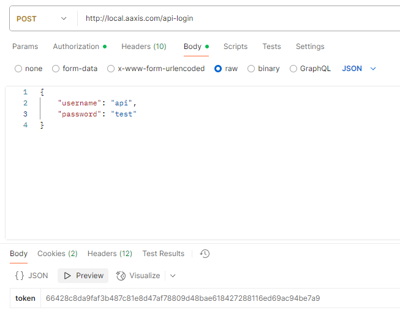
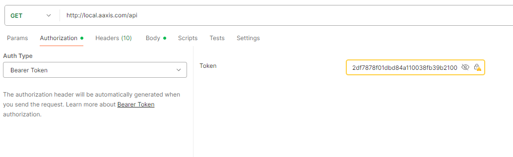

Docker with 3 containers.

one for php 8.2, another for mysql, another for ngingx

Edit your hosts files and add the following line:

``127.0.0.1 local.aaxis.com``

Lets boot up the server:

```docker-compose up --build -d```

When done you will have 3 images:
- aaxis-php
- aaxis-dbserver
- aaxis-web

Create Database and user for access

```bash
docker exec -it aaxis-dbserver mysql
CREATE DATABASE aaxis;
GRANT ALL ON aaxis.* TO 'root'@'%' IDENTIFIED BY 'password';
FLUSH PRIVILEGES;
exit
```

Configure Symfony

```bash

docker-exec -it aaxis-php bash
composer install
bin/console d:s:u --force
chmod -R 777 var/cache
bin/console create-user
```

Now we have created a user for the API.
It's credentials
api as username
test as password

For creating a token you must call first via POST the following url: /local.aaxis.com/api-login
with this parameters as raw BODY:

{
"username": "api",
"password": "test"
}
This will return a token.




Now copy that token and use it calling the API as a Bearer Token as such:


